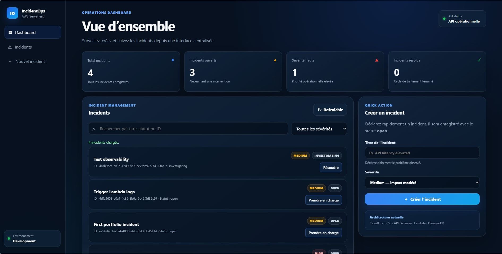
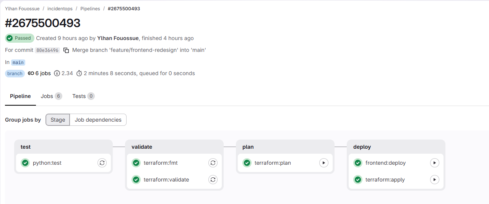
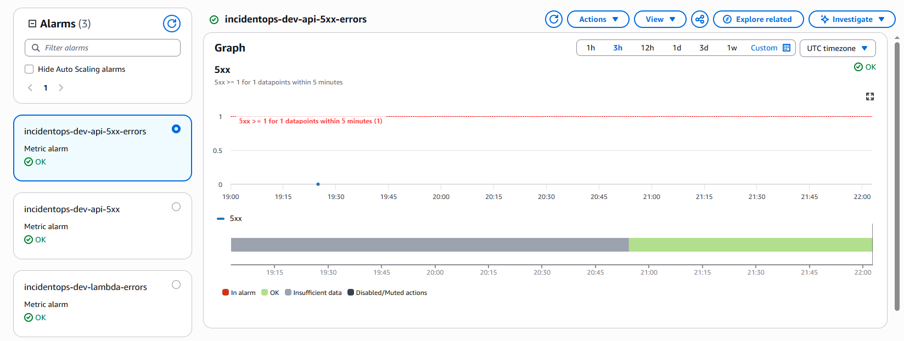
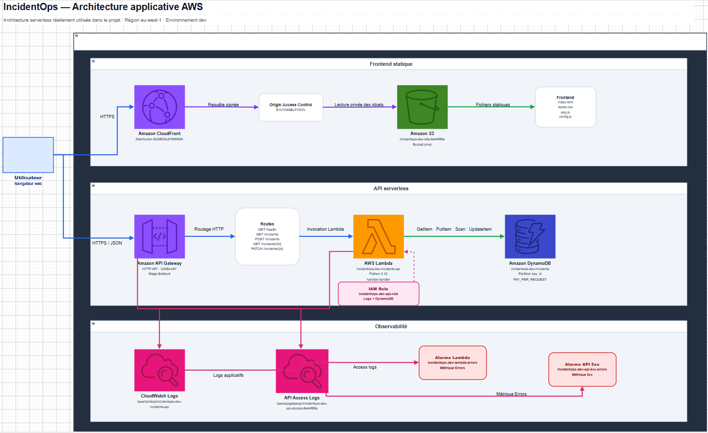
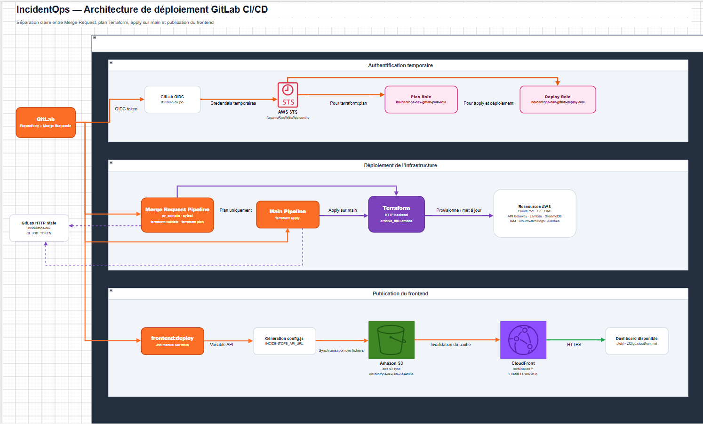

# IncidentOps

[](#architecture)
[](#infrastructure-as-code)
[](#cicd)
[](#stack-technique)
[](#tests)
[](#)

IncidentOps est une application serverless de gestion d’incidents déployée sur AWS.

Le projet met en œuvre une architecture cloud sécurisée, observable et entièrement provisionnée avec Terraform, avec une chaîne CI/CD GitLab authentifiée auprès d’AWS par OIDC.

L’application permet de créer, rechercher, filtrer et suivre des incidents tout au long de leur cycle de vie :

```text
open → investigating → resolved → open
```

## Démonstration

- **Dashboard** : https://dtqbjr4y22jgc.cloudfront.net
- **API** : `https://1ji5i8km87.execute-api.eu-west-1.amazonaws.com`
- **Région AWS** : `eu-west-1`

> Les URL correspondent à l’environnement de démonstration actuel et peuvent changer si l’infrastructure est recréée.

## Aperçu

### Dashboard



### Pipeline GitLab CI/CD



### Supervision CloudWatch



## Fonctionnalités

- Création d’un incident avec titre et niveau de sévérité.
- Consultation de la liste des incidents.
- Consultation d’un incident par identifiant.
- Recherche par titre, statut ou identifiant.
- Filtrage par sévérité et par statut.
- Mise à jour du cycle de vie d’un incident.
- Mise à jour de l’interface sans rechargement complet.
- Mode démonstration local lorsque l’URL de l’API n’est pas configurée.
- Journalisation Lambda et API Gateway dans CloudWatch.
- Alarmes CloudWatch sur les erreurs Lambda et les réponses API 5xx.
- Déploiement automatisé du frontend et de l’infrastructure avec GitLab CI/CD.

## Architecture

L’architecture est documentée sous deux angles complémentaires :

1. **Architecture applicative AWS** : parcours d’une requête utilisateur, hébergement du frontend, API serverless, persistance et observabilité.
2. **Architecture de déploiement** : GitLab CI/CD, OIDC, AWS STS, rôles IAM, Terraform Remote State et publication du frontend.

### Architecture applicative AWS



Le frontend est distribué par CloudFront depuis un bucket S3 privé accessible uniquement au moyen d’un Origin Access Control. Le navigateur appelle l’API Gateway HTTP API, qui invoque la fonction Lambda. Lambda applique la logique métier et lit ou modifie les incidents dans DynamoDB. Les journaux et les métriques sont centralisés dans CloudWatch.

```text
Utilisateur
  ├── CloudFront → S3 privé
  └── API Gateway → Lambda → DynamoDB
                         └── CloudWatch Logs et alarmes
```

### Architecture de déploiement GitLab CI/CD



Les Merge Requests exécutent les validations, les tests et `terraform plan`. Après fusion dans `main`, la pipeline peut appliquer l’infrastructure et publier le frontend. GitLab s’authentifie auprès d’AWS grâce à OIDC ; AWS STS fournit ensuite des identifiants temporaires associés au rôle IAM approprié.

```text
Branche feature
  → tests et validations
  → terraform plan
  → Merge Request
  → merge vers main
  → terraform apply
  → génération de config.js
  → synchronisation S3
  → invalidation CloudFront
```

## Stack technique

| Domaine | Technologies |
|---|---|
| Frontend | HTML, CSS, JavaScript |
| CDN | Amazon CloudFront |
| Stockage frontend | Amazon S3 privé |
| API | Amazon API Gateway HTTP API |
| Backend | AWS Lambda, Python 3.12 |
| Base de données | Amazon DynamoDB, mode on-demand |
| Infrastructure as Code | Terraform |
| CI/CD | GitLab CI/CD |
| Authentification CI/CD | GitLab OIDC, AWS STS |
| État Terraform | GitLab HTTP Remote State |
| Observabilité | CloudWatch Logs, CloudWatch Alarms |
| Tests | Pytest |

## Infrastructure as Code

L’infrastructure est provisionnée avec Terraform et comprend notamment :

- un bucket S3 privé pour le frontend ;
- une distribution CloudFront ;
- un Origin Access Control pour l’accès CloudFront vers S3 ;
- une API Gateway HTTP API ;
- une fonction Lambda Python 3.12 ;
- une table DynamoDB ;
- les rôles et policies IAM ;
- les groupes de logs CloudWatch ;
- les alarmes CloudWatch ;
- les rôles GitLab OIDC pour les jobs `plan` et `apply`.

L’état Terraform est stocké dans GitLab via le backend HTTP distant.

## Sécurité

- Bucket S3 non public.
- Accès au bucket uniquement via CloudFront Origin Access Control.
- Credentials AWS temporaires obtenus avec GitLab OIDC et AWS STS.
- Aucune access key AWS permanente requise dans GitLab CI/CD.
- Rôles distincts pour le plan et le déploiement.
- Permissions IAM limitées aux ressources IncidentOps.
- Validation des valeurs de statut côté backend.
- Protection contre la mise à jour d’un incident inexistant.
- CORS configuré au niveau API Gateway pour les méthodes nécessaires.

## API

### URL de base

```text
https://1ji5i8km87.execute-api.eu-west-1.amazonaws.com
```

### Vérifier l’état de l’API

```http
GET /health
```

Exemple de réponse :

```json
{
  "status": "healthy",
  "environment": "dev"
}
```

### Lister les incidents

```http
GET /incidents
```

### Consulter un incident

```http
GET /incidents/{id}
```

### Créer un incident

```http
POST /incidents
Content-Type: application/json
```

```json
{
  "title": "API latency elevated",
  "severity": "high"
}
```

### Modifier le statut d’un incident

```http
PATCH /incidents/{id}
Content-Type: application/json
```

```json
{
  "status": "investigating"
}
```

Valeurs acceptées :

```text
open
investigating
resolved
```

## Structure du dépôt

```text
incidentops/
├── .gitlab-ci.yml
├── frontend/
│   ├── app.js
│   ├── config.template.js
│   ├── index.html
│   └── styles.css
├── infra/
│   └── terraform/
│       └── environments/
│           └── dev/
│               ├── backend.tf
│               ├── main.tf
│               ├── outputs.tf
│               ├── terraform.tfvars.example
│               ├── variables.tf
│               └── versions.tf
├── src/
│   └── api/
│       └── handler.py
├── tests/
│   └── test_handler.py
├── docs/
│   ├── architecture/
│   │   ├── incidentops-application-architecture.drawio
│   │   ├── incidentops-application-architecture.png
│   │   ├── incidentops-deployment-architecture.drawio
│   │   └── incidentops-deployment-architecture.png
│   ├── screenshots/
│   │   ├── dashboard.png
│   │   ├── gitlab-pipeline.png
│   │   └── cloudwatch-alarms.png
│   ├── architecture.md
│   ├── cost-control.md
│   ├── gitlab-cicd.md
│   ├── learning-map.md
│   ├── observability.md
│   └── test-runbook.md
└── README.md
```

## Prérequis

- Compte AWS.
- AWS CLI.
- Terraform.
- Python 3.12.
- Git.
- Compte GitLab avec CI/CD activé.
- Budget AWS recommandé avant le déploiement.

## Configuration locale

```powershell
cd infra/terraform/environments/dev
Copy-Item terraform.tfvars.example terraform.tfvars
```

Exemple :

```hcl
aws_region   = "eu-west-1"
project_name = "incidentops"
environment  = "dev"

enable_gitlab_oidc   = true
gitlab_project_path  = "your-group/your-project"
gitlab_deploy_branch = "main"

log_retention_days = 14
```

NOus avons pas commite de secrets ni d’informations sensibles dans `terraform.tfvars`.

## Déploiement Terraform

```powershell
terraform -chdir=infra/terraform/environments/dev init
terraform -chdir=infra/terraform/environments/dev validate
terraform -chdir=infra/terraform/environments/dev plan
terraform -chdir=infra/terraform/environments/dev apply
terraform -chdir=infra/terraform/environments/dev output
```

Dans le workflow GitLab, l’`apply` est exécuté uniquement après merge vers `main`.

## CI/CD

### Merge Request

- validation Python ;
- tests Pytest ;
- validation Terraform ;
- `terraform plan`.

### Branche `main`

- `terraform apply` ;
- déploiement du frontend dans S3 ;
- invalidation du cache CloudFront.

### Variables CI/CD principales

```text
AWS_DEFAULT_REGION
AWS_PLAN_ROLE_ARN
AWS_DEPLOY_ROLE_ARN
INCIDENTOPS_API_URL
SITE_BUCKET_NAME
CLOUDFRONT_DISTRIBUTION_ID
```

Les rôles AWS sont assumés grâce à GitLab OIDC.

## Tests

```powershell
python -m pip install pytest
python -m pytest -v
python -m py_compile src/api/handler.py
```

Les tests couvrent notamment :

- le health check ;
- la liste des incidents ;
- la création d’un incident ;
- la mise à jour du statut ;
- le rejet d’un statut invalide ;
- les routes inexistantes.

## Tests manuels de l’API

```powershell
$API_URL = "https://1ji5i8km87.execute-api.eu-west-1.amazonaws.com"
```

### Lister les incidents

```powershell
Invoke-RestMethod `
  -Uri "$API_URL/incidents" `
  -Method Get
```

### Créer un incident

```powershell
$body = @{
  title    = "Portfolio test"
  severity = "medium"
} | ConvertTo-Json

Invoke-RestMethod `
  -Uri "$API_URL/incidents" `
  -Method Post `
  -ContentType "application/json" `
  -Body $body
```

### Modifier un statut

```powershell
$body = @{
  status = "investigating"
} | ConvertTo-Json

Invoke-RestMethod `
  -Uri "$API_URL/incidents/INCIDENT_ID" `
  -Method Patch `
  -ContentType "application/json" `
  -Body $body
```

## Observabilité

### Groupes de logs

```text
/aws/lambda/incidentops-dev-incidents-api
/aws/apigateway/incidentops-dev-api-access-8e44f88e
```

### Consulter les logs Lambda

```powershell
aws logs tail `
  "/aws/lambda/incidentops-dev-incidents-api" `
  --region eu-west-1 `
  --since 15m
```

### Alarmes CloudWatch

- `incidentops-dev-lambda-errors`
- `incidentops-dev-api-5xx-errors`

```powershell
aws cloudwatch describe-alarms `
  --alarm-name-prefix "incidentops-dev-" `
  --region eu-west-1 `
  --query "MetricAlarms[].{Name:AlarmName,State:StateValue,Metric:MetricName}" `
  --output table
```

## Coûts

Le projet est conçu pour un trafic faible et utilise principalement des services facturés à l’usage :

- Lambda ;
- API Gateway ;
- DynamoDB on-demand ;
- S3 ;
- CloudFront ;
- CloudWatch.

La rétention des logs a été limitée pour pourvoir reduire le budget AWS.

## Compétences démontrées

- Conception d’une architecture AWS serverless.
- Infrastructure as Code avec Terraform.
- Gestion d’un état Terraform distant.
- CI/CD GitLab avec stratégie Merge Request.
- Fédération d’identité GitLab OIDC vers AWS.
- Mise en œuvre du principe du moindre privilège IAM.
- Déploiement d’un frontend statique sécurisé avec S3 et CloudFront.
- Développement d’une API Lambda connectée à DynamoDB.
- Configuration CORS d’une HTTP API.
- Tests unitaires Python avec Pytest.
- Journalisation et supervision avec CloudWatch.
- Diagnostic d’erreurs applicatives, IAM et CI/CD.

## Limites assumées

Cette version est un MVP portfolio. Elle ne comprend pas encore :

- authentification utilisateur ;
- domaine personnalisé ;
- environnement de production séparé ;
- notifications Slack ou Teams ;
- historique complet des changements de statut ;
- dashboard CloudWatch dédié.

## Documentation complémentaire

- [Architecture](docs/architecture.md)
- [CI/CD GitLab](docs/gitlab-cicd.md)
- [Observabilité](docs/observability.md)
- [Runbook de test](docs/test-runbook.md)
- [Contrôle des coûts](docs/cost-control.md)

## Auteur

**Ylhan Fouossue Yemzeue**

Projet DevOps, Cloud et Serverless réalisé avec AWS, Terraform, GitLab CI/CD et Python.