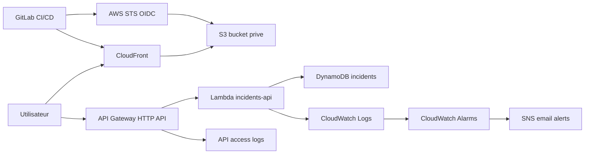

# IncidentOps Serverless Hub

IncidentOps Serverless Hub est un projet portfolio AWS construit pour pratiquer les concepts de l'examen **AWS Certified Solutions Architect Associate** et demontrer une architecture cloud moderne, serverless, securisee et observable.

L'application permet de creer et lister des incidents operationnels depuis une interface web statique. Le frontend est servi par CloudFront, l'API est exposee par API Gateway, la logique tourne sur Lambda, et les donnees sont stockees dans DynamoDB.

> Region du projet : `eu-west-1` (Ireland)

## Apercu

| Domaine | Implementation |
| --- | --- |
| Frontend | HTML/CSS/JavaScript statique |
| CDN | Amazon CloudFront |
| Stockage frontend | Amazon S3 prive |
| API | API Gateway HTTP API |
| Compute | AWS Lambda Python 3.12 |
| Database | DynamoDB on-demand |
| Infrastructure as Code | Terraform |
| CI/CD | GitLab CI/CD |
| Auth CI/CD AWS | GitLab OIDC + AWS STS |
| Observabilite | CloudWatch Logs, CloudWatch Alarms, SNS email |
| Region | `eu-west-1` |

## Architecture



## Fonctionnalites

- Creation d'incidents avec titre et severite.
- Lecture des incidents via API.
- Frontend deploye sur S3 et distribue par CloudFront.
- Bucket S3 prive avec acces via CloudFront Origin Access Control.
- API serverless avec API Gateway et Lambda.
- Table DynamoDB en mode `PAY_PER_REQUEST`.
- IAM least privilege pour Lambda et GitLab.
- Pipeline GitLab avec validation Python, validation Terraform, plan manuel et deploy frontend manuel.
- GitLab OIDC pour eviter les access keys longues durees.
- Logs CloudWatch pour Lambda et API Gateway.
- Alarmes CloudWatch avec notifications email via SNS.

## Captures d'ecran a ajouter

Cree un dossier `docs/screenshots/`, puis ajoute ces images :

| Fichier conseille | Capture a prendre | Pourquoi elle compte |
| --- | --- | --- |
| `docs/screenshots/frontend.png` | Page CloudFront avec la liste des incidents | Montre l'application finale accessible publiquement |
| `docs/screenshots/gitlab-pipeline.png` | Pipeline GitLab passe avec les jobs verts | Montre la partie CI/CD |
| `docs/screenshots/aws-architecture-resources.png` | Console AWS avec Lambda, API Gateway ou CloudFront | Montre que les ressources existent dans AWS |
| `docs/screenshots/cloudwatch-logs.png` | CloudWatch Log group avec logs Lambda/API | Montre l'observabilite |
| `docs/screenshots/cloudwatch-alarms.png` | Alarmes CloudWatch `incidentops-dev-*` | Montre le monitoring |
| `docs/screenshots/sns-email-alert.png` | Email SNS recu ou subscription confirmee | Montre les alertes email |
| `docs/screenshots/terraform-output.png` | Terminal avec `terraform output` | Montre les endpoints et outputs Terraform |

Quand les captures sont ajoutees, tu peux decommenter ces lignes :

```md


```

## Structure du projet

```text
.
+-- .gitlab-ci.yml
+-- frontend/
|   +-- app.js
|   +-- config.template.js
|   +-- index.html
|   +-- styles.css
+-- infra/
|   +-- terraform/
|       +-- environments/
|           +-- dev/
|               +-- main.tf
|               +-- outputs.tf
|               +-- terraform.tfvars.example
|               +-- variables.tf
|               +-- versions.tf
+-- src/
|   +-- api/
|       +-- handler.py
+-- docs/
    +-- architecture.md
    +-- cost-control.md
    +-- gitlab-cicd.md
    +-- learning-map.md
    +-- observability.md
    +-- test-runbook.md
```

## Prerequis

- AWS CLI configure.
- Terraform installe.
- Python 3.12.
- Compte GitLab avec CI/CD active.
- Budget AWS configure avant de deployer.

## Configuration

Copier l'exemple :

```powershell
cd infra/terraform/environments/dev
Copy-Item terraform.tfvars.example terraform.tfvars
```

Exemple de `terraform.tfvars` :

```hcl
aws_region   = "eu-west-1"
project_name = "incidentops"
environment  = "dev"

enable_gitlab_oidc   = true
gitlab_project_path  = "your-group/your-project"
gitlab_deploy_branch = "main"

log_retention_days = 14
alarm_email        = "your-email@example.com"
```

Definitions :

- `aws_region` : region AWS ou les ressources sont creees.
- `project_name` : prefixe logique utilise pour nommer les ressources.
- `environment` : environnement cible, ici `dev`.
- `enable_gitlab_oidc` : active l'authentification GitLab vers AWS sans access keys longues durees.
- `gitlab_project_path` : chemin GitLab du repo, par exemple `group/project`.
- `log_retention_days` : nombre de jours de conservation des logs CloudWatch.
- `alarm_email` : email qui recoit les alertes SNS.

## Deploiement infrastructure

```powershell
cd infra/terraform/environments/dev
terraform init
terraform validate
terraform plan
terraform apply
terraform output
```

Definitions :

- `terraform plan` montre ce que Terraform va creer ou modifier.
- `terraform apply` applique les changements dans AWS.
- `terraform output` affiche les valeurs utiles comme l'URL API, le bucket S3 et la distribution CloudFront.

## Deploiement frontend

Le frontend est deploye par GitLab CI/CD avec le job manuel `frontend:deploy`.

Variables GitLab CI/CD a configurer :

```text
AWS_DEFAULT_REGION=eu-west-1
AWS_ROLE_ARN=<terraform output gitlab_deploy_role_arn>
INCIDENTOPS_API_URL=<terraform output api_url>
SITE_BUCKET_NAME=<terraform output site_bucket_name>
CLOUDFRONT_DISTRIBUTION_ID=<terraform output cloudfront_distribution_id>
```

Le job genere `frontend/config.js`, synchronise le dossier `frontend/` vers S3, puis invalide le cache CloudFront.

## Tests rapides

Tester l'API :

```powershell
cd infra/terraform/environments/dev
$api = terraform output -raw api_url
Invoke-RestMethod "$api/incidents"

Invoke-RestMethod "$api/incidents" `
  -Method Post `
  -ContentType "application/json" `
  -Body '{"title":"Portfolio test","severity":"medium"}'

Invoke-RestMethod "$api/incidents"
```

Lire les logs :

```powershell
aws logs tail "/aws/lambda/incidentops-dev-incidents-api" --region eu-west-1 --since 15m

$apiLogs = terraform output -raw api_access_log_group_name
aws logs tail $apiLogs --region eu-west-1 --since 15m
```

Tester une alerte email :

```powershell
aws cloudwatch set-alarm-state `
  --region eu-west-1 `
  --alarm-name "incidentops-dev-lambda-errors" `
  --state-value ALARM `
  --state-reason "Manual portfolio test"
```

Remettre l'alarme a OK :

```powershell
aws cloudwatch set-alarm-state `
  --region eu-west-1 `
  --alarm-name "incidentops-dev-lambda-errors" `
  --state-value OK `
  --state-reason "Manual reset"
```

Commandes detaillees : [docs/test-runbook.md](docs/test-runbook.md).

## Securite

- Le bucket S3 du frontend n'est pas public.
- CloudFront accede au bucket via Origin Access Control.
- Lambda utilise un role IAM limite a la table DynamoDB du projet.
- GitLab utilise OIDC et AWS STS pour obtenir des credentials temporaires.
- Les access keys longues durees ne sont pas necessaires pour le deploiement GitLab une fois OIDC active.

Definitions :

- **IAM least privilege** : donner uniquement les permissions necessaires.
- **OIDC** : mecanisme d'identite permettant a GitLab de demander des credentials temporaires a AWS.
- **AWS STS** : service AWS qui genere des credentials temporaires.
- **OAC** : Origin Access Control, mecanisme CloudFront pour acceder a un bucket S3 prive.

## Observabilite

- CloudWatch Logs collecte les logs Lambda et API Gateway.
- CloudWatch Alarms surveille les erreurs Lambda et API Gateway.
- SNS envoie les notifications email.
- Les logs API Gateway ont une retention configuree par Terraform.

Guide detaille : [docs/observability.md](docs/observability.md).

## Cout

Le projet utilise des services adaptes a un faible trafic :

- S3 et CloudFront pour un frontend statique.
- Lambda et API Gateway avec facturation a l'usage.
- DynamoDB en mode on-demand.
- Retention limitee des logs.

Un budget AWS est recommande avant tout deploiement. Voir [docs/cost-control.md](docs/cost-control.md).

## Ce que ce projet demontre

- Design d'une architecture serverless.
- Deploiement Infrastructure as Code avec Terraform.
- Securisation d'un site statique avec S3 prive et CloudFront.
- Integration API Gateway, Lambda et DynamoDB.
- CI/CD GitLab avec deploiement manuel controle.
- Federation GitLab OIDC vers AWS.
- Observabilite avec logs, alarmes et notifications email.
- Maitrise des compromis cout, securite, simplicite et scalabilite.

## Limites actuelles

Le projet est fini pour un MVP portfolio. Les limites actuelles sont volontaires :

- pas d'authentification utilisateur dans l'application ;
- pas de domaine custom ;
- pas de backend Terraform distant ;
- pas de tests automatises complets de l'API ;
- pas de dashboard CloudWatch dedie.

## Ameliorations possibles

- Ajouter Amazon Cognito pour proteger l'API.
- Ajouter un domaine custom avec Route 53 et ACM.
- Ajouter un backend Terraform S3 + DynamoDB lock.
- Ajouter un dashboard CloudWatch.
- Ajouter des tests unitaires Python avec `pytest`.
- Ajouter WAF devant CloudFront.
- Ajouter un environnement `prod` separe de `dev`.

## Documentation

- [Architecture](docs/architecture.md)
- [CI/CD GitLab](docs/gitlab-cicd.md)
- [Observabilite](docs/observability.md)
- [Runbook de test](docs/test-runbook.md)
- [Controle des couts](docs/cost-control.md)
- [Carte d'apprentissage AWS SAA](docs/learning-map.md)
