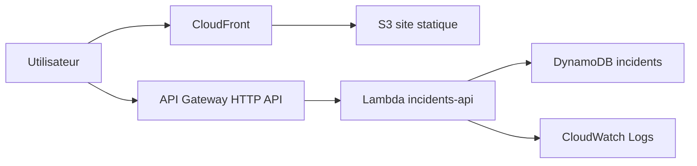

# IncidentOps Serverless Hub

Projet portfolio AWS pour preparer la certification AWS Solutions Architect Associate.

L'objectif est de construire une petite plateforme cloud de suivi d'incidents :

- un frontend statique heberge sur S3 et distribue par CloudFront ;
- une API serverless avec API Gateway et Lambda ;
- une base DynamoDB pour les incidents ;
- des permissions IAM minimales ;
- de l'observabilite avec CloudWatch ;
- une discipline de cout avec AWS Budgets avant tout deploiement reel.

Ce projet est concu pour etre construit progressivement. Chaque phase produit quelque chose de montrable dans un portfolio et revise un groupe de concepts AWS.

## Architecture cible



## Roadmap

1. **Fondation locale**
   - Repo Git propre
   - Documentation d'architecture
   - Structure Terraform
   - Handler Lambda minimal

2. **Infrastructure AWS**
   - S3 + CloudFront pour le frontend
   - API Gateway + Lambda
   - DynamoDB en mode on-demand
   - IAM least privilege

3. **Application**
   - UI simple pour creer et lister des incidents
   - Endpoints `GET /incidents`, `POST /incidents`, `GET /incidents/{id}`
   - Validation et erreurs propres

4. **Production readiness**
   - Logs CloudWatch
   - Alarmes de base
   - Budget AWS
   - Tags de cout
   - README portfolio avec capture, diagramme et decisions d'architecture

5. **Extensions possibles**
   - Authentification Cognito
   - Notifications SNS/EventBridge
   - WAF devant CloudFront
   - Pipeline CI/CD GitLab
   - Multi-environnement `dev` / `prod`

## Demarrage local

Prerequis :

- AWS CLI configure
- Terraform installe
- Python 3.12 pour tester le handler Lambda localement

Tester le handler :

```powershell
python src/api/handler.py
```

Initialiser Terraform :

```powershell
cd infra/terraform/environments/dev
terraform init
terraform plan -var-file="terraform.tfvars"
```

Region par defaut du projet : `us-east-1`.

Avant un `terraform apply`, cree un budget AWS dans la console ou via IaC. Le guide est dans [docs/cost-control.md](docs/cost-control.md).

## CI/CD GitLab

Le pipeline GitLab valide le code automatiquement et peut deployer le frontend vers S3/CloudFront manuellement. Le guide est dans [docs/gitlab-cicd.md](docs/gitlab-cicd.md).

## Ce que tu pourras expliquer en entretien

- Pourquoi CloudFront devant S3 plutot qu'un bucket public.
- Pourquoi DynamoDB on-demand est adapte au demarrage.
- Comment IAM limite Lambda a la table necessaire.
- Comment API Gateway decouple le client de Lambda.
- Quels compromis cout/performance/securite ont ete faits.
- Comment l'architecture respecte les piliers Well-Architected.
